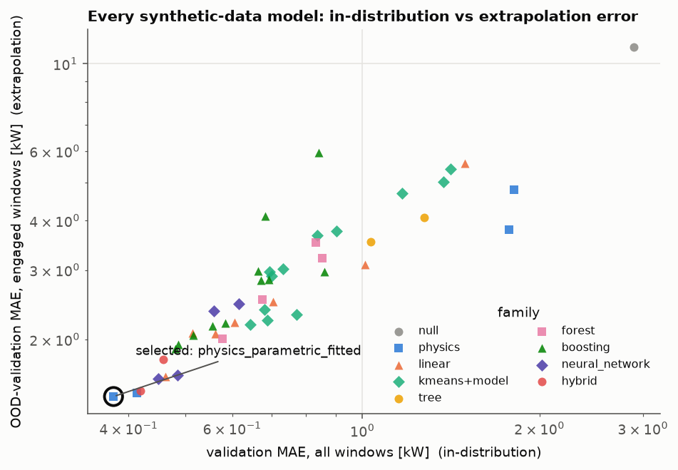
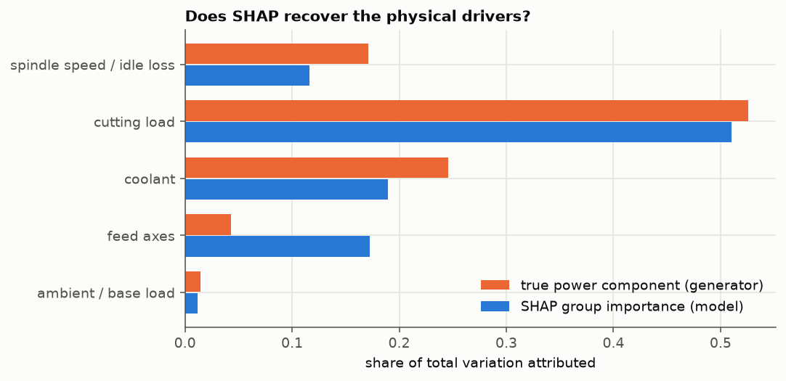
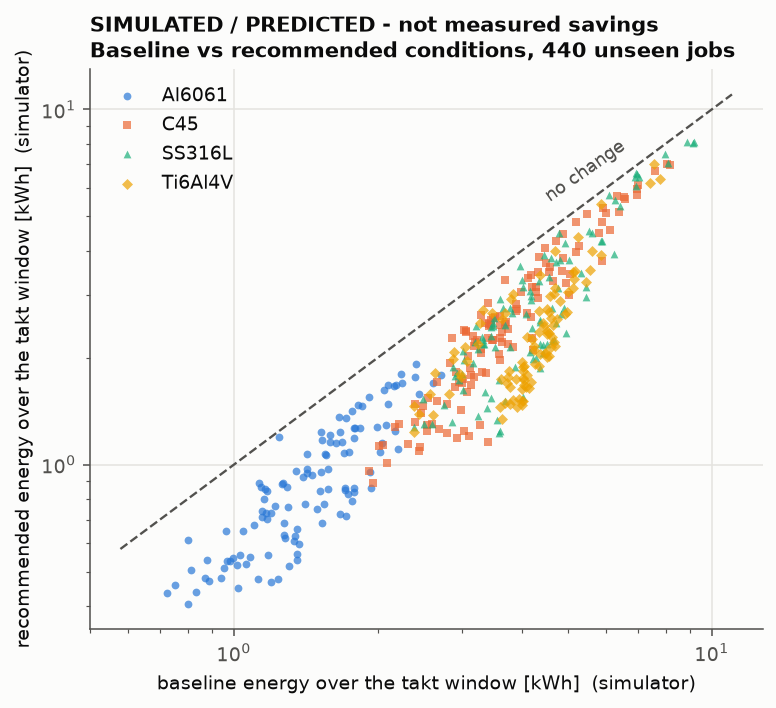

# AI-Driven Energy Optimization in Metal Manufacturing

A reproducible investigation of how a CNC milling machine's electrical power depends on its operating conditions:
predict it, explain it, find out which windows use far more energy than expected, and search for operating conditions
that cut energy without missing production requirements.

> ### Read this first - what is real and what is simulated
> * **REAL public data** (CFAA milling tests, Zenodo [10.5281/zenodo.14445879](https://doi.org/10.5281/zenodo.14445879), CC BY 4.0,
>   two machining centres, 6 000 rows each) is in `data/raw/`. It has only spindle speed, override, two axis loads and Z-axis power -
>   **no feed, depth of cut, torque, timestamps or run ids** - so it cannot support optimisation, and it turned out to be unreliable
>   for predictive claims (see *Negative results*).
> * **SYNTHETIC data** (`data/synthetic/`, 27 027 ten-second windows) is produced by a physics-based simulator with hidden factors,
>   noise, glitches and injected inefficiencies. It carries the experiments, anomaly labels and optimisation.
> * **Every saving quoted here is PREDICTED or SIMULATED.** None is a measured or claimed industrial saving.

## Headline results

| Question | Answer (synthetic data unless stated) |
|---|---|
| Which model was selected? | A **fitted physics equation** with 21 coefficients, chosen by a rule frozen before the runs - not an ML model. |
| How good is it? | On 440 unseen jobs: **MAE 0.365 kW, RMSE 1.010 kW, R² 0.931, MAPE 3.3 %** (noise floor: MAE 0.165 kW). |
| Where does ML fall short? | Beyond the training range of material-removal rate the physics model keeps R² 0.67 (cutting windows); tuned trees go negative (−0.75 to −2.2), MLP/poly-2 with physics features ≈ 0.05. |
| Did deep learning win? | **No.** On raw features a small MLP (5 seeds) modestly beat tuned LightGBM (val MAE 0.616 vs 0.665) and random forest (0.833); with physics features it tied (0.485 vs 0.481); it never beat the physics equation (0.377). On the real data it lost to trees. |
| Did K-Means regimes help? | K-Means finds standby and rapid moves perfectly but mixes air-cut and cutting (ARI 0.39). Per-regime models cut a linear model's MAE by 39 %, helped the polynomial slightly and **hurt** boosting. |
| What drives power? | Depth and width of cut, coolant mode, feed-axis state, spindle speed, material. Fixed and speed-dependent loads are ≈ 60 % of the power of a window in which metal is being cut. |
| Can residuals flag inefficiency? | Out-of-fold: precision 0.82, recall 0.91 at window level; job level precision 0.96 / recall 0.68. Potential inefficiency, not failure diagnosis. |
| What can be saved? | **Simulated** mean saving **37 %** (95 % CI 35.8-38.6) of energy over a fixed takt window, model-predicted 39.6 %, by finishing in a third of the time at higher chip load and lower speed. An upper bound inside the simulation: the baseline is sampled, and chatter, finish and fixturing limits are not modelled. |



### Final comparison on untouched test data (synthetic)
Models trained on the train split only; `test` = 440 unseen jobs; `OOD-test` = 150 jobs with removal rates above anything seen in training.
Test numbers were computed for all models but **not used for any decision** (selection used validation and an OOD-validation band).

| model | test MAE | RMSE | R² | MAPE % | OOD-test MAE (cutting) | OOD-test R² |
|---|---|---|---|---|---|---|
| mean (null) | 2.649 | 3.832 | -0.000 | 38.9 | 9.41 | -5.44 |
| 2-parameter SEC, fitted | 1.774 | 2.435 | 0.596 | 26.1 | 16.90 | -20.45 |
| handbook physics, zero fit | 1.775 | 2.274 | 0.648 | 18.7 | 2.31 | 0.24 |
| ridge polynomial-3, raw features | 0.567 | 1.135 | 0.912 | 5.9 | 2.11 | 0.40 |
| K-Means regimes + ridge poly-2 | 0.582 | 1.147 | 0.910 | 6.0 | 2.20 | 0.40 |
| decision tree (tuned) | 0.990 | 1.701 | 0.803 | 9.7 | 6.12 | -2.20 |
| random forest (tuned, raw) | 0.751 | 1.367 | 0.873 | 7.3 | 5.58 | -1.68 |
| LightGBM (tuned, raw) | 0.624 | 1.193 | 0.903 | 6.1 | 4.21 | -0.75 |
| LightGBM + physics features | 0.462 | 1.048 | 0.925 | 4.6 | 2.35 | 0.34 |
| ridge poly-2 + physics features | 0.444 | 1.025 | 0.928 | 4.5 | 2.87 | 0.05 |
| MLP, 5-seed ensemble, raw | 0.532 | 1.132 | 0.913 | 5.2 | 2.06 | 0.40 |
| MLP, 5-seed ensemble, physics features | 0.434 | 1.017 | 0.930 | 4.3 | 3.08 | 0.04 |
| hybrid: physics + LightGBM on residuals | 0.409 | 0.999 | 0.932 | 4.0 | 1.38 | 0.65 |
| **fitted physics equation (selected)** | **0.367** | 1.013 | 0.930 | **3.3** | **1.29** | **0.66** |

The selected model refit on train+val: test MAE 0.365, RMSE 1.010, R² 0.931, MAPE 3.29; OOD-test (cutting) MAE 1.292, R² 0.667.
In-distribution, the best five models are within 0.10 kW MAE of each other; extrapolation is where they separate.

**Caveat on the physics result.** The simulator is built from the same functional forms (Kienzle cutting force, no-load loss polynomial,
copper loss, coolant steps), so this shows the structure is *recoverable from noisy data by a fit started from imperfect catalogue
values* (15 of 21 coefficients land within ±10 %, `results/tables/final_model_param_recovery.csv`). It does **not** show that physics models beat ML on real machines.

## The machine and its physics
A 3-axis vertical machining centre with an 18.5 kW spindle (cutting speeds and tool-life constants for Al6061, C45 steel, 316L stainless, Ti-6Al-4V).

```
P_el = P_base + P_amb(T) + P_coolant(mode) + P_conveyor·[cutting]
     + [ P_cut + P_idle(n)·warmup(t) + r_cu·T² ] / η_inverter          (spindle)
     + P_servo + b·v_axis + F_feed·v_f                                   (feed axes)
MRR = a_p·a_e·v_f ,  v_f = f_z·z·n ,  h_m = f_z·sqrt(a_e/D)
k_c = k_c1.1·h_m^(−m_c) ,  P_cut = k_c·MRR / 6·10⁷ [kW] ,  T = 9550·P_cut/n
Energy of a window: E = P·Δt   (Δt = 10 s)
```
The machine-level special case `P = P₀ + k·MRR` (Gutowski's specific-energy model) explains 64 % of variance alone; the
remaining structure is speed-dependent idle loss and coolant. Code: `src/physics.py`.

## Data
| | Real | Synthetic |
|---|---|---|
| Location | `data/raw/` (md5-verified against Zenodo, see `data/raw/README.md`) | `data/synthetic/` (regenerated bit-for-bit; sha256 in `synthetic_metadata.json`) |
| Processed | `data/processed/real_*_clean.csv` | `data/processed/synthetic_clean.csv` |
| Target | `powerDrive_SPINDLE` [kW] | `power_kw` [kW] (energy = power × 10 s) |
| Noise/outliers | as measured | 1.5 % + 0.04 kW meter noise, 0.7 % glitches (spikes ×1.6-3, dropouts), workpiece-lot scatter, tool-specific life, cold-start friction, about 7 % of jobs carry an injected inefficiency (stuck coolant, worn tool, bearing friction, air/hydraulic leak, axis drag) |

Planning models see **commanded** conditions only. Voltage/current/cos φ are excluded (they reproduce the target: R² 0.95) and so are the drive's load signals (R² 0.94 when added); E01 quantifies both.

## Method
* **Splits (synthetic):** by *job*. The highest-MRR jobs form two extrapolation bands never used for training or tuning (`ood_val`, `ood_test`); the rest is 60/20/20 train/val/test. Hyper-parameters are tuned by grouped CV on train only; scalers, K-Means, physics coefficients and network early-stopping are fitted inside `fit(train)`.
* **Metrics:** MAE, RMSE, R², MAPE (rows ≥ 1 kW), overall and on cutting windows.
* **Pre-registered protocol:** `experiments/PROTOCOL.md` fixes splits, metrics, the selection rule and all expectations before the runs. `experiments/LOG.md` reports each experiment against them (why / expected / happened / better or worse / learned / next) and ends with a scorecard - several expectations were wrong.
* **Selection rule:** `score = 0.5·MAE_val/min + 0.5·MAE_oodval/min`, ties within 2 % to the simpler model. MAE because 0.7 % meter glitches put an irreducible floor under RMSE (0.88 kW even for an oracle).

## Experiments
| | | | |
|---|---|---|---|
| E00 physics baselines | E01 EDA + leakage audit | E02 linear / polynomial | E03 K-Means regimes |
| E04 decision tree | E05 random forest | E06 XGBoost / LightGBM | E07 feature engineering, re-tuning |
| E08 neural network (5 seeds) | E09 SHAP + permutation importance | E10 physics-structured / hybrid | E11 frozen-rule selection |
| E12 residual anomaly detection | E13 constrained optimisation | E14 real-data reliability probes | |



## Anomaly detection (E12)
`residual = actual − predicted` (out-of-fold), scaled by a robust heteroscedastic MAD, flagged above 3.5 and 0.4 kW excess.
Window level: precision 0.815, recall 0.906, average precision 0.72 (base rate 4.3 %). Recall by injected cause: stuck high-pressure coolant 0.94,
air/hydraulic leak 0.92, bearing friction 0.90, excess tool wear 0.82. Flagged windows contain 90 % of the true excess energy. Half of the false positives are
meter glitches. On extrapolation jobs recall falls to 0.61 - the detector is only as good as the predictor in that region. On the real data the top-flagged rows
are listed in `results/tables/e12_flagged_windows_real_*.csv` as candidates only (no ground truth).

## Optimisation (E13) - predicted / simulated
Minimise energy over a fixed takt window (standby included) subject to: same cycle time, spindle power/torque with margin, tool life, cutting-speed window, feed/depth ranges, and MRR inside the model's trust region.
Current conditions = recorded settings of 440 unseen jobs; recommended conditions verified in a noise-free simulator.

| | simulated mean saving | model-predicted |
|---|---|---|
| energy over the takt window (headline) | **37.2 %** (95 % CI 35.8-38.6) | 39.6 % |
| operation only (ignores idling after finishing early - upper bound) | 58.6 % | 60.8 % |

All 440 jobs improve, none overloads the simulated spindle. Which model drives the optimiser matters for *honesty* more than for the result:
simulated savings are 35-38 % for every sensible model, but tree ensembles *predicted* 42-44 % (over-optimistic by 6-9 points), the physics model 39 % (2 points).
A first version that ignored standby energy reported 58.6 % as the headline; that accounting error is documented in the log.



## Negative and surprising results (kept on purpose)
* **Real-data tree scores are not generalisation.** Random-split R² 0.74-0.85 collapses to −0.13 / −1.43 under input-space-grouped CV; a 1-nearest-neighbour regressor already gets 0.64-0.72 (E14).
* The best decision tree memorises (train MAE 0.000) and tuned random forests lose to a cubic polynomial on the same features.
* Robust loss functions (Huber, L1) did **not** help gradient boosting.
* Letting ML correct the fitted physics equation made it *worse* (MAE 0.377 → 0.419).
* K-Means did not recover the four physical states; silhouette prefers k=10; per-regime boosting models were worse than one global model.
* Feature engineering beat hyper-parameter tuning several times over (LightGBM: tuning −4 % MAE, physics features −28 %).

## Limitations
* Synthetic conclusions hold inside the simulator's assumptions; the generator shares functional forms with the winning model.
* The real dataset lacks the variables needed for the project's main question and is a class-balanced, shuffled subsample with an undocumented label; its scores are descriptive.
* The optimisation omits chatter stability, surface finish, fixture rigidity, tool-change logistics and scheduling; the baseline is sampled rather than observed. The 37 % figure is an upper bound in the simulator.
* The 0.4 kW significance threshold of the detector equals the simulator's labelling threshold by design.
* Window energy is modelled as power × 10 s steady-state; transients and part-level energy accounting are not simulated.

## Repository layout
```
data/raw/            real CFAA data (unchanged) + provenance        data/synthetic/   simulator output + metadata
data/processed/      cleaned data with split column, prep reports   notebooks/        01 data/EDA, 02 progression, 03 final+anomaly+optimisation (executed)
src/                 config, physics, generator, features, models, optimiser, harness, plot style
experiments/         PROTOCOL.md (frozen), LOG.md (results narrative), e00…e14 scripts, results/*.json
results/             figures/, tables/ (leaderboards, parameter recovery, optimisation per job), models/final_model.joblib
tests/               split, leakage, physics and feature-consistency tests
```

## Reproduce
```bash
python -m venv .venv && . .venv/bin/activate && pip install -r requirements.txt
bash run_all.sh        # about 1 hour on 14 cores; all seeds fixed; regenerates every table, figure, notebook
python -m pytest -q    # fast sanity tests
```
Versions used are pinned in `requirements.txt` (Python 3.14.6). Fitted models of the experiments are cached in `.cache/` (not shipped).

## Attribution
Real data: Tapia Fernandez E., Sastoque Pinilla L., Lopez-Novoa U., *Milling tests in 2 machining centres: Energy consumption data*, Zenodo, 2024, doi:10.5281/zenodo.14445879, CC BY 4.0 (redistributed unchanged).
No code license is included; choose one before redistributing.
